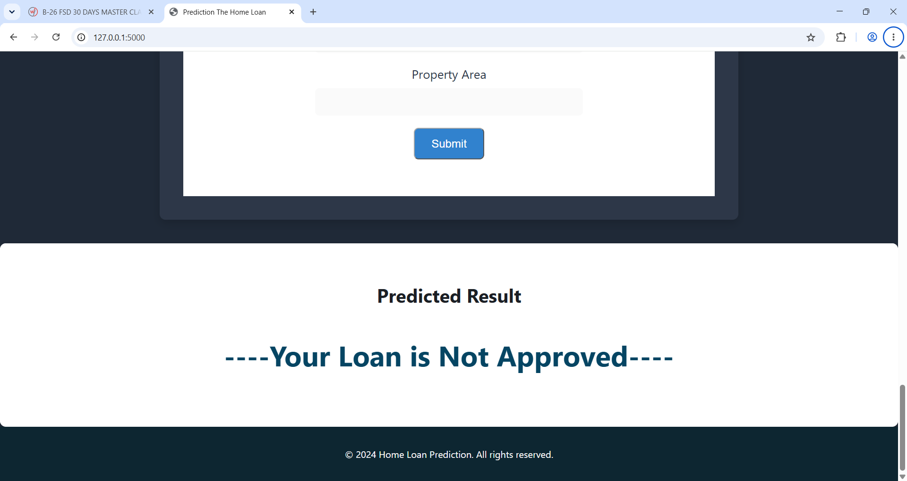

# 🏦 Smart Loan Approval Prediction Web Application

<p align="center">

### 🤖 Machine Learning Based Loan Approval Prediction System

A **Machine Learning-powered web application** that predicts whether a loan application is likely to be **Approved or Not Approved** based on applicant details such as income, loan amount, credit history, education, employment status, and property area.

The application is built using **Python, Flask, Scikit-learn, Joblib, HTML5, and Tailwind CSS**, providing a simple, responsive, and user-friendly interface for instant loan prediction.

</p>

---

## 🚀 Live Demo

🔗 **Live Application:** https://automated-loan-approval.onrender.com

> 

## 📂 GitHub Repository

🔗 **Source Code:** https://github.com/rutujamalpani5141-lgtm/Automated-Loan_approval.git

---

## 📋 Table of Contents

* [✨ Features](#-features)
* [🛠️ Technologies Used](#️-technologies-used)
* [⚙️ Installation](#️-installation)
* [📁 Project Structure](#-project-structure)
* [📸 Screenshots](#-screenshots)
* [🔄 How It Works](#-how-it-works)
* [🤖 Model Information](#-model-information)
* [📊 Model Performance](#-model-performance)
* [🌐 Deployment](#-deployment)
* [🔮 Future Enhancements](#-future-enhancements)
* [⚠️ Disclaimer](#️-disclaimer)
* [👩‍💻 Author](#-author)

---

# ✨ Features

* 🏦 Predicts **home loan approval** based on applicant information.
* 🤖 Uses a **Decision Tree Classification** Machine Learning model.
* ⚡ Provides **instant prediction results**.
* 🎨 Simple and responsive user interface.
* 📱 Responsive design for different screen sizes.
* 🔐 Processes user-provided financial and personal information.
* 📊 Uses multiple applicant and loan-related features for prediction.
* 🌐 Flask-based web application.
* ☁️ Ready for cloud deployment using **Render**.
* 💾 Uses a pre-trained model stored as `model.pkl`.

---

# 🛠️ Technologies Used

| Category                | Technologies        |
| ----------------------- | ------------------- |
| 🐍 Programming Language | Python              |
| 🌐 Backend              | Flask               |
| 🎨 Frontend             | HTML5, Tailwind CSS |
| 🤖 Machine Learning     | Scikit-learn        |
| 💾 Model Serialization  | Joblib              |
| 📊 Data Processing      | SciPy               |
| 📓 Development          | Jupyter Notebook    |
| ☁️ Deployment           | Render              |
| 📦 Version Control      | Git & GitHub        |

---

# ⚙️ Installation

Follow the steps below to run the project locally.

### 1️⃣ Clone the Repository

```bash
git clone YOUR_GITHUB_REPOSITORY_URL
```

### 2️⃣ Move to the Project Directory

```bash
cd Loan-Approval-Prediction
```

### 3️⃣ Create a Virtual Environment

```bash
python -m venv .env
```

### 4️⃣ Activate the Virtual Environment

**Windows:**

```bash
.env\Scripts\activate
```

**Linux/macOS:**

```bash
source .env/bin/activate
```

### 5️⃣ Install Required Dependencies

```bash
pip install -r requirements.txt
```

### 6️⃣ Run the Flask Application

```bash
python app.py
```

### 7️⃣ Open in Browser

Open:

```text
http://127.0.0.1:5000/
```

---

# 📁 Project Structure

```text
Loan-Approval-Prediction/
│
├── static/
│   ├── favicon.png
│   ├── logo.png
│   ├── Designer.png
│   └── styles.css
│
├── templates/
│   └── index.html
│
├── app.py
├── Loan Prediction.ipynb
├── loan-test.csv
├── loan-train.csv
├── model.pkl
├── requirements.txt
└── README.md
```

### 📌 File Description

| File / Folder           | Description                                                |
| ----------------------- | ---------------------------------------------------------- |
| `static/`               | Contains CSS, images, favicon and other frontend resources |
| `templates/`            | Contains the HTML templates                                |
| `app.py`                | Main Flask application and prediction logic                |
| `Loan Prediction.ipynb` | Jupyter Notebook used for Machine Learning experimentation |
| `loan-train.csv`        | Training dataset                                           |
| `loan-test.csv`         | Testing dataset                                            |
| `model.pkl`             | Pre-trained Decision Tree model                            |
| `requirements.txt`      | Required Python dependencies                               |
| `README.md`             | Project documentation                                      |

---

# 📸 Screenshots

## 🏠 Home Page

The application provides a simple form where users can enter their personal, financial, and loan-related information.


---

## 🎯 Prediction Result

After submitting the application, the trained Machine Learning model processes the entered information and displays the predicted loan approval result.

> 📸 


# 🔄 How It Works

The application follows a simple Machine Learning workflow:

```text
        👤 User
          │
          ▼
  📝 Enter Loan Details
          │
          ▼
   🌐 Flask Web Application
          │
          ▼
   ⚙️ Data Processing
          │
          ▼
 🤖 Decision Tree Model
          │
          ▼
   🔮 Make Prediction
          │
          ▼
   ✅ Approved / ❌ Not Approved
```

### 1️⃣ Form Submission

Users enter their personal and financial information, including:

* Gender
* Marital Status
* Dependents
* Education
* Self-Employment Status
* Applicant Income
* Co-Applicant Income
* Loan Amount
* Loan Term
* Credit History
* Property Area

### 2️⃣ Data Processing

When the user submits the form, the data is sent to the Flask backend using a **POST request**.

The application processes the input into the format required by the trained Machine Learning model.

### 3️⃣ Prediction

The Flask application loads the pre-trained `model.pkl` file and passes the processed input to the **Decision Tree Classification model**.

### 4️⃣ Result Display

The model predicts whether the loan application is likely to be:

**✅ Loan Approved**

or

**❌ Loan Not Approved**

The result is displayed directly on the web page.

---

# 🤖 Model Information

### 📌 Machine Learning Type

**Supervised Machine Learning – Classification**

### 📌 Algorithm Used

**Decision Tree Classifier**

The Decision Tree algorithm is suitable for classification problems because it makes predictions using a sequence of decision rules based on the input features.

### 📌 Dataset

The Machine Learning model is trained using a **loan application dataset obtained from Kaggle**.

The dataset contains information about applicants and their previous loan outcomes.

### 📌 Important Features

The model uses features such as:

* Applicant Income
* Co-Applicant Income
* Loan Amount
* Loan Term
* Credit History
* Education
* Employment Status
* Marital Status
* Dependents
* Property Area
* Gender

### 📌 Model File

The trained model is serialized and stored as:

```text
model.pkl
```

The Flask application loads this model during runtime to make predictions for new loan applications.

---

# 📊 Model Performance

The Decision Tree Classification model achieved approximately:

## 🎯 **77.8% Accuracy**

This indicates that the model correctly predicted approximately **77.8% of the loan outcomes on the evaluated data**.

### Evaluation Metric

| Metric          |                   Result |
| --------------- | -----------------------: |
| 🎯 Accuracy     |                **77.8%** |
| 🤖 Model        | Decision Tree Classifier |
| 📌 Problem Type |           Classification |

> **Note:** Model performance may vary depending on the dataset split, preprocessing steps, and training configuration.

---

# 🌐 Deployment

The application is designed to be deployed as a Flask web application using **Render**.

### Deployment Requirements

The project contains the required files for deployment:

```text
app.py
model.pkl
requirements.txt
templates/
static/
```

A typical Render configuration uses:

**Build Command:**

```bash
pip install -r requirements.txt
```

**Start Command:**

```bash
gunicorn app:app
```

After deployment, the application can be accessed through the generated Render URL.

---

# 🔮 Future Enhancements

The project can be further improved by adding:

* 📊 Prediction probability/confidence score.
* 🌲 Comparison with Random Forest and Logistic Regression.
* 📈 Model performance dashboard.
* 👤 User registration and login.
* 💾 Database integration for storing loan applications.
* 📋 Loan application history.
* 🔐 Secure user authentication.
* 📄 Document upload and verification.
* 🧠 Explainable AI for showing why a loan was approved or rejected.
* 📱 Improved mobile responsiveness.
* 🔌 REST API for integrating the prediction model with other applications.
* ☁️ Improved cloud deployment and scalability.


---

# 👩‍💻 Author

### Rutuja Malpani

🎓 B.Tech – Computer Science and Engineering

🔗 **GitHub:** https://github.com/rutujamalpani5141.lgtm

🔗 **LinkedIn:** https://www.linkedin.com/in/rutuja-malpani-1059b137b

---

## ⭐ Project Highlights

<p align="center">

**Python** • **Flask** • **Machine Learning** • **Scikit-learn** • **Decision Tree** • **Tailwind CSS** • **GitHub** • **Render**

</p>

---

## Model Information

- The machine learning model is trained using a dataset of loan applications 
   which is created from __Kaggle__.

- The model uses features like __income, loan amount, credit history, and other personal information__ to make predictions.

- We used the __DecisionTreeClassification__ model which is well optimized for the Classification problems 

- The model is provides us **77.8% accuracy**.

- The model is saved as __model.pkl__ and loaded by the Flask app during runtime to make predictions.
